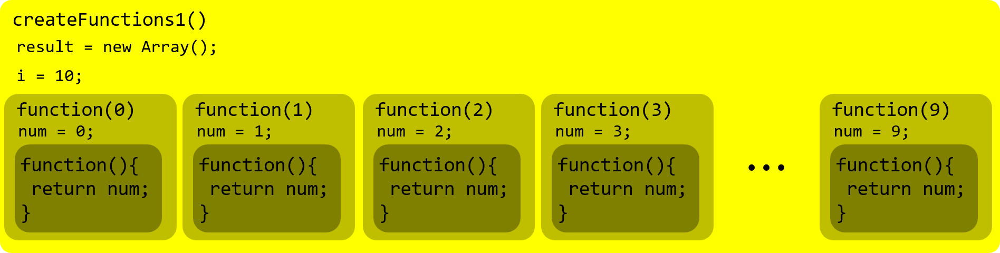
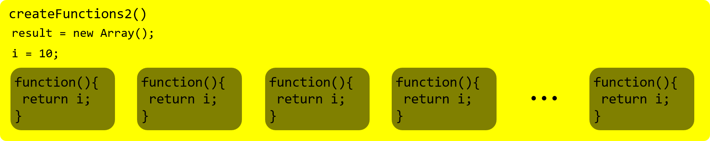

# 주제

## 발표자

- 김주완

## 참여자

- 김라희, 안소현, 이상아

## 내용

### 자바스크립에서의 함수
1. 어떤 작업을 수행하기 위해 필요한 statement들의 집합을 정의한 코드 블록.
1. 이름과 매개변수를 갖는다.
1. 일급 객체다.
    * 변수에 할당할 수 있다.
    * 매개변수로 전달할 수 있다.
    * 함수가 함수를 반환할 수 있다.
1. 간단히 말하면 JavaScript에서 모든 함수는 `Function` 객체이다.

### 함수 vs 메소드
사실 **함수**와 **메소드**는 다른게 아니다.  
단지 **함수**가 어느 **객체**에 속해있을 때 이를 **메소드**라 부른다.  
이 때, **객체** 내에서 **property**로써 정의된 **함수**가 **메소드**가 되며,  
별다른 귀속(?)없이 정의된 **내부함수**의 실행의 주체는 내부함수를 가지고 있는 객체가 아닌 **window**가 된다.

```javascript
var value=100;

var myOb={
	value:1,
	func1:function(){
		this.value +=1;
        // func1()의 this는 method의 객체
		console.log("func1 called this.value : "+this.value);

		func2=function(){
			this.value +=1;
            // func1()의 내부함수인 func2()의 this는 window
			console.log("func2 called this.value : "+this.value);
				func3=function(){
					this.value+=1;
				    // func2()와 마찬가지로 내부함수인 func3()의 this 또한 window
					console.log("func3 called this.value : "+this.value);
				}
				func3();
		}
		func2();
	}
};
myOb.func1();

// >> "func1 called this.value : 2"
// >> "func2 called this.value : 101"
// >> "func3 called this.value : 102"
```

### 함수 정의하기
함수를 정의하는 방법은 [여기](https://developer.mozilla.org/ko/docs/Web/JavaScript/Reference/Functions)를 보면 자세히 알 수 있다.
그래서 몇가지만 간단히 소개하고 넘어가도록 하겠다.

소개에 앞서 선언문에 쓰이는 몇가지 요소에 대해 설명하겠다.
##### 용어
1. `name`: 별거 없다. 함수의 이름을 뜻한다.
1. `param`: 말그대로 parameter다. 함수에 전달되는 인수의 이름이다.
1. `statements`: 함수의 동작, body라고 할 수 있다.
1. `expression`: 연산자와 같이 하나 이상의 값으로 표현될 수 있는 코드라고 한다. 이것도 body라고 보면 될 듯하다.
1. `arg`: argument.., parameter와 비슷한 의미로 생각하면 될 듯하다.

##### 기호
1. `[]`: 생략이 가능하다는 뜻으로 이해하면 된다.
1. `()`: 모두가 알다시피 parameterㄴ나 arguments를 감싸는 용도
1. `{}`: 마찬가지로 모두가 아는 `body`를 감싸는 용도
1. `=>`: 화살표 함수 표현식에서 다시 언급하겠다.

#### 함수 선언문
```javascript
function name([param[,param[, ... param]]]){
    statements
}
```

#### 함수 표현식
```javascript
/******
 * 익명함수가 가능하다
 ******/
function [name]([param[,param[, ... param]]]){
    statements
}

/******
 *익명함수로 쓰일 때
 ******/
// 1.
var myFunction = function(){
    statements
}
// 2.
var myFunction = function namedFunction(){
    statements
}
// 3.
(function(){
    statements
})();
```

#### 화살표 함수 표현식
```javascript
([param[,param]]) => {
    statements
}
// 또는
param => expression
```

#### Function constructor
```javascript
new Function(arg1, arg2, ... argN, functionBody)
```

##### parameter vs argument
parameter와 argument는 비슷한 위치에서 사용된다는 걸 느꼈다.  
하지만, 그 둘의 차이점은 명확하지 않았기에 궁금해서 좀 더 조사해봤다.    
간단하게 말해서 그 둘의 차이는 **이름**과 **실제값**이라는 것이었다.  

영어|한글|의미
|:---:|:---:|:---|
parameter|매개변수|함수나 메소드로 전달되는 값들을 가리키는 명칭
argument|전달인자|함수나 메소드로 전달되는 실제 값

```javascript
function add(a, b){ // 전달된 값의 이름인 a와 b
    return a + b
}
add(1, 2);  // argument인 1과 2
num1 = 2;
num2 = 3;
add(num1, num2);    // argument인 num1과 num2에 담긴 실제 값 2와 3
```

### 함수 선언식 vs 함수 표현식
함수 선언식은 **호이스팅**되지만 함수 표현식은 이에 해당되지 않는다.  
좀 더 정확히 말해보자면 `function`, `var`, `function *` 등과 같은 선언은 호이스팅에 따라  
해당 선언이 스크립트 가장 위쪽으로 끌어 올려지게 된다는 것이다.
  
다음의 예를 통해 좀더 자세히 알아보자.
```javascript
// 실행 전 코드
console.log(helloworldDcl());
console.log(helloworldExp());

function helloworldDcl(){
    return 'Hello world declaration';
}

var helloworldExp = function(){
    return 'hello world Expression';
};

// >> "Hello world declaration"
// >> "error"
// >> "TypeError: helloworldExp is not a function ~
```
위 코드를 자바스크립트 해석기는 다음과 같이 인식하게 된다.
```javascript
// 실행할 때
function helloworldDcl(){   // 함수선언이 호이스팅된 helloworldDcl()
    return 'Hello world declaration';
}
var helloworldExp;  // 변수 선언이 호이스팅된 helloworldExp()

console.log(helloworldDcl());
console.log(helloworldExp());

var helloworldExp = function(){
    return 'hello world Expression';
};

// >> "Hello world declaration"
// >> "error"
// >> "TypeError: helloworldExp is not a function ~
```

### Closure로 사용
우리는 자바스크립트에서 내부함수를 사용할 때 **클로저**를 만들어 외부함수의 변수에 접근할 수 있다.  
이 때, 우리는 **함수 생성자**로는 **클로저** 생성이 불가능하다.  

다음의 예를 통해 **함수 생성자**와 일반 선언문과의 차이를 알아볼 수 있다.
```javascript
var x = 10;

function func1(){
    var x = 20;
    // 함수 생성자는 Closure를 따로 생성하지 않기 때문에
    // func1()의 x값이 아닌 window의 x값을 참조한다.
    // 따라서 10을 반환하게 된다.
    return new Function('return x;');
}

function func2(){
    var x = 20;
    function f(){
        return x;
    }
    // 내부함수로 선언된 f()가 Closure를 생성한다.
    // 20을 반환하게 된다.
    return f;
}
``` 

또한, **함수 표현식**을 통해 한 개의 내부함수에 서로 다른 parameter를 여러개 넘겨줄 수 있다.  
이게 무슨 말인지는 다음의 예시를 통해 확인할 수 있다.
```javascript
function createFunctions1(){ 
    var result = new Array();
    
    for (var i = 0 ; i < 10 ; i++){ 
        // 익명 함수 표현식을 이용해 for문이 돌아가는 동안에 변하는 i값을 넘겨준다.
        // result에는 1~10까지의 i값이 들어간 함수 배열이 생성된다.
        result[i] = function(num){ 
            return function(){ 
                return num; 
            } 
        }(i); 
    } 
    return result; 
}
```

다만, 위와 같은 **함수 표현식**의 사용은 주의해야할 점이 있다.  
해당 사항은 아래의 예시에서 확인할 수 있다.
```javascript
function createFunctions2(){ 
    var result = new Array(); 
    
    for (var i = 0 ; i < 10 ; i++){ 
        // 아래의 익명 함수 표현식에서는 i값을 직접 내부함수로 넘겨주고 있다.
        result[i] = function(){ 
            return i; 
        } 
    } 
    return result; 
}
```
`createFunction2()`에서 사용된 **함수 표현식**의 상태를 보면 외부함수에서 정의된 i값을 그대로 내부함수에서 사용했다.  
앞서 소개된 `createFunctions1()`에서는 내부 익명함수가 parameter로 `num`을 가지고 있으며 이를 통해 i값이 내부함수로 전달된다.  
이 두 함수를 통해 반환된 배열을 각각 출력해보면 아래와 같은 결과가 나온다.
```javascript
for (var i = 0; i<10; i++){
    console.log(createFunctions1()[i]());
}
// >> 0
// >> 1
// >> 2
// >> 3
// >> 4
// >> 5
// >> 6
// >> 7
// >> 8
// >> 9

for (var i = 0; i<10; i++){
    console.log(createFunctions2()[i]());
}
// >> 10
// >> 10
// >> 10
// >> 10
// >> 10
// >> 10
// >> 10
// >> 10
// >> 10
// >> 10
```

위와 같은 차이를 보이는 이유는 두 함수가 가진 **내부 함수의 개수**가 다르기 때문입니다.  
`createFunctions1()`의 경우, `num`을 parameter로 가지는 **익명 함수**와 **그 함수의 내부함수**로 총 2개의 내부함수가 있다.  
`createFunctions2()`의 경우, result 배열에 반환되는 **내부 함수** 하나만 있다.

그렇다면, 지금부터 내부 함수의 개수가 어떻게 반환되는 배열에 영향을 미칠 수 있었는가에 대해 알아보겠다.  
내부 함수가 생성되면서 내부 함수에서 외부 함수의 변수에 접근할 수 있도록 **내부 함수의 스코프 체인**에 **외부 함수의 스코프**를 포함시킨다.  
이 때, 내부 함수의 스코프 체인에 포함된 **외부 함수의 스코프**에 있는 변수 i값이 앞서 언급된 각 함수들이 반환하는 배열에 들어갔던 것이다.

##### `createFunctions1()`
1. `num`을 parameter로 가지는 익명함수가 for문이 돌아가면서 `function(num)`의 스코프를 스코프 체인에 담고 있는 내부 익명함수가 생성된다.  
1. 이 때, `num`에 넘겨진 i값 0~9가 `function(0)`, `function(1)`, ... , `function(9)`를 새로 만든다.
1. 그 안의 **내부 익명함수**가 방금 만들어진 함수들의 스코프를 자신들의 스코프에 포함시킨다.


##### `createFunctions2()`
1. for문의 실행으로 10개의 내부 함수가 생성된다.
1. 이 10개의 내부 함수의 **스코프 체인**으로 연결된 외부 함수는 `createFunctions2()`다.
1. 모두 같은 외부 함수의 스코프를 공유하기 때문에 for문이 실행되고 10으로 변한 값을 가진 i를 참조할 수 밖에 없다.

---
###### 참고 자료
- [MDN-JavaScript](https://developer.mozilla.org/ko/docs/Web/JavaScript/Reference/Functions)
- [PoiemaWeb|JavaScript](https://poiemaweb.com/js-function)
- [황준일님 블로그-1급객체](http://junil-hwang.com/blog/javascript-1%EA%B8%89%ED%95%A8%EC%88%98/)
- [expression vs statement](https://shoark7.github.io/programming/knowledge/expression-vs-statement)
- [Okky 질문글](https://okky.kr/article/453415)
- [초보몽키님의 개발블로그](https://wayhome25.github.io/etc/2017/12/31/parameter-argument/)
- [함수 표현식 vs 함수 선언석](https://joshua1988.github.io/web-development/javascript/function-expressions-vs-declarations/)
- [Kendrick's Blog](https://blog.sonim1.com/142)
- [실행 컨텍스트와 활성 객체, 변수 객체 및 스코프 체인](https://beny-pitapat.tistory.com/58)
