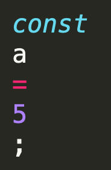
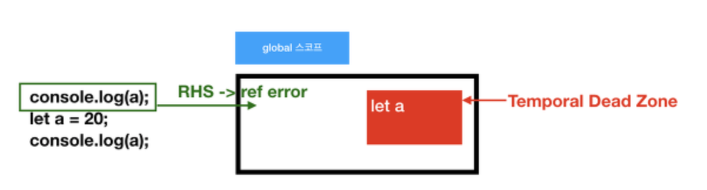
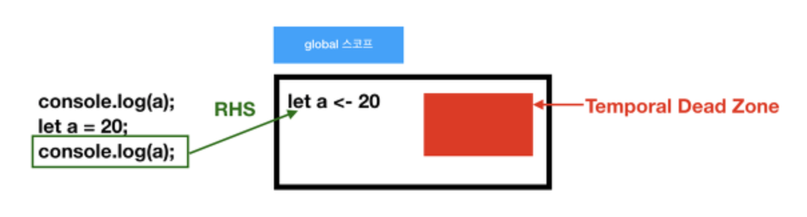
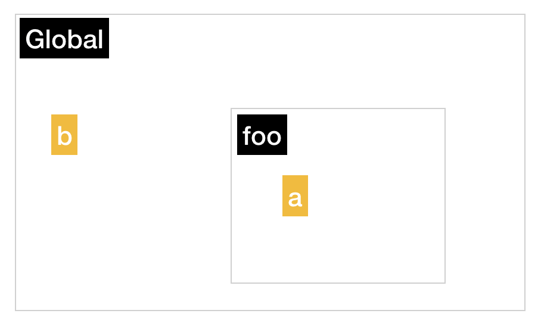
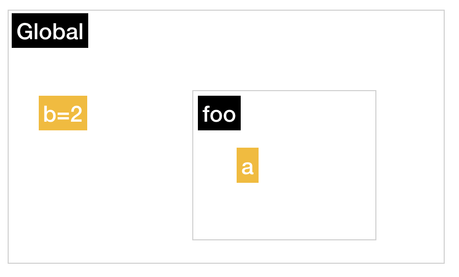
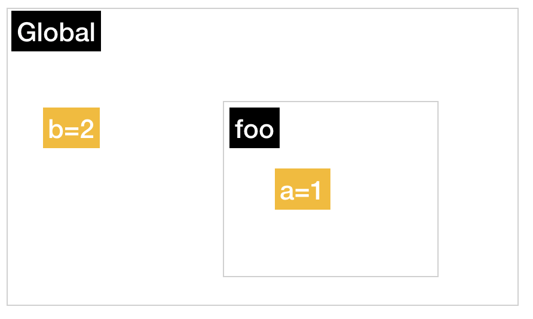
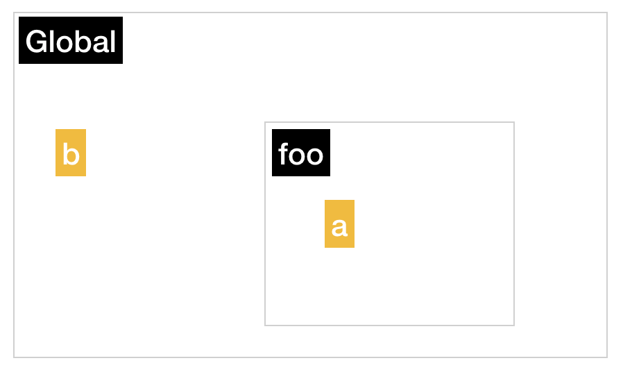
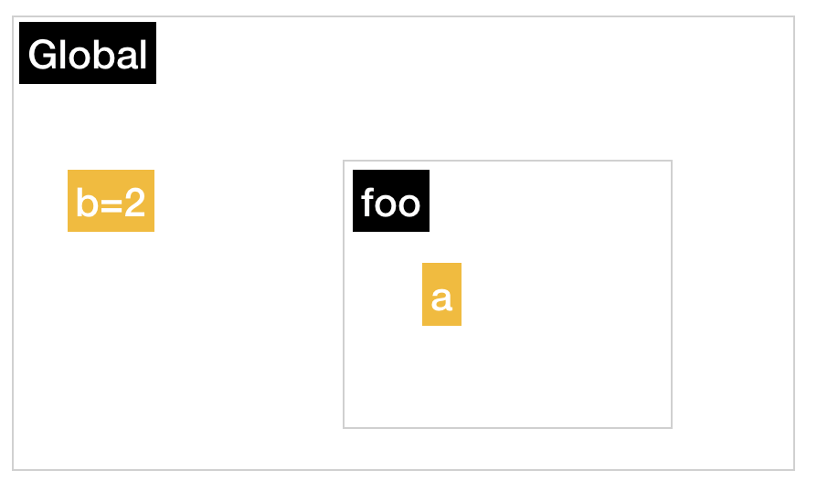
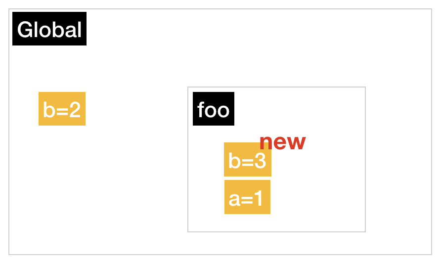

# 주제

## 발표자

- 이상아

## 참여자

- 김주완, 안소현, 양유성, 이상아, 이소윤

## 내용
### 1. Scope

> 스코프는 흔히, 변수의 생존 범위 라고 알고 있다. 나 또한 그렇게만 생각하고 있었다. 물론 이 말이 마냥 틀린것은 아니지만,  스코프는 보다 넓은 개념을 포함하는 단어이다. 
>
> 그래서 스코프를 알기 전에, 자바스크립트 프로그램이 어떻게 작동하는지를 먼저 볼것이다.

#### 자바스크립트 프로그램은 어떻게 실행될까?

* 자바스크립트 프로그램은 **Engine, Compiler, Scope**에 의해 실행된다. (보다 정확하게는 엔진에 의해 실행되지만, 컴파일러와 스코프는 엔진의 명령에 따라 각기 맡은 일을 하기 때문에, 각각에 의해 실행된다는 것도 마냥 틀리지만은 않다고 생각한다)

#### Engine

* Compilation의 전 과정과 자바스크립트 프로그램 실행의 전 과정을 담당한다. (우리가 흔히 아는 V8은 자바스크립트의 다양한 엔진 중 하나이다)

#### Compiler (Do compilation)

* 컴파일레이션을 한다. 컴파일레이션이란 엔진이 실행할 수 있는 코드를 생성하는 과정을 말한다. 
* 컴파일레이션은 `토크나이징/렉싱`, `파싱`, `코드 생성` 의 총 3단계로 이루어져있다.


##### 예시와 함께 보자.

* 아래와 같은 자바스크립트 프로그램이 있다. 
* 이해를 돕기 위해 작성한 거라서 실제와 조금 다르다. 보다 정확하고 자세하게 알고싶다면 [이 사이트](https://gyujincho.github.io/2018-06-19/AST-for-JS-devlopers)를 방문해보자.


##### 토크나이징/렉싱 (Tokenizing/Lexing)

* 문자열을 나누어, token이라 하는 의미 있는 조각으로 나누는 것을 말한다.

* 이 과정을 거치면, 그림처럼 `const`, `a`, `=`, `5`, `=` 으로 나뉘어진다.



##### 파싱 (Parsing)

* 토큰 배열을 프로그램의 문법 구조를 반영하여 트리 구조로 만드는 것을 말한다. 이 과정을 거쳐 만들어진 것을 AST(Abstract Syntax Tree) 라 한다. 

* 이 과정을 거치면, 그림과 같은 (똑같지는 않다) AST가 생성된다.


##### 코드 생성 (Code-Generation)

* 엔진이 실행할 수 있는 코드를 생성한다.


#### Scope

* 스코프는 **변수의 생존범위** 를 말한다, 라고 하면 틀린 말은 아니다. 하지만 뭔가 아쉬움이 있다. 왜냐하면 스코프는 이보다 큰 개념을 포함하는 단어이기 때문이다.

##### 스코프와 변수

* 코드를 작성하는동안 다양하고 많은 변수들이 선언되고 할당되고 사용된다. 그렇다면 프로그램은 어떤 변수가 어디에 저장되어있는지 **어떻게 찾는걸까**? **어떤 규칙이 필요하지 않을까**? 
* 이러한 일을 하는 것이 스코프이다. 즉 스코프는 생존 범위 만을 말하는 것이 아니라, **규칙에 따라 변수에 관한 목록을 작성하고 관리**하는 것을 말한다. 따라서  `스코프는 변수의 생존범위를 말한다`  라는 정의는 조금 아쉬움이 남는 것이다.


#### 컴파일러와 엔진과 스코프가 어떻게 자바스크립트 프로그램을 실행하는지를 알아보자

* 1번 코드와 2번 코드는 같은 역할을 수행한다. 
* 1번 코드는 사용자가 작성한 코드이고, 2번 코드는 1번 코드가 컴파일레이션을 거치며 만들어진 엔진이 실행시킬 코드이다. (완전 똑같지는 않지만, 의미적으로 비슷하다)

```javascript
// 1
var a = 5; 
console.log(a); // 5
```

```javascript
// 2
var a;
a = 5;

console.log(a);
```


##### 엔진이 `2번 코드` 를 실행하는 동안, 무슨 일이 일어날까?

* `var a;` 이건 컴파일러가 실행하는 코드로, **컴파일러가 스코프에게 변수 a가 특정한 스코프 컬렉션(a.k.a 범위) 안에 있는지를 물어보는 것**이다. 이미 컬렉션 안에 있다면 무시하고 지나가고, 없다면 **컴파일러가 스코프에게** 스코프 컬렉션에 추가하라고 요청한다.

* `a = 5;` 이건 엔진이 실행하는 코드로, 엔진은 이 코드를 처리하는 동안 두 가지의 일을 한다.
  1. `a` 는 현재 스코프 컬렉션 내에서 접근할 수 있는가?
  2. 그렇다면 `a` 에게 `5` 를 할당한다. (그렇지 않다면 다른 중첩 스코프를 본다)

* 이렇게 a에게 5가 할당이 되었다. 그리고 `console.log(a);` 를 실행하여 5를 출력하게 되었다.


##### 그러니까 엔진은 무엇을 한거라구?

* 값을 할당하고 (`a = 5;`), 값을 불러오는 혹은 접근하는 (`console.log(a);`) 두 가지의 일을 한 것이다. 이것을 좀 더 자세히 보자.


##### 할당하고, 불러오기

앞선 소스로 한 일을 크게 나누어서 생각해보면, **엔진**은 **할당하는 것** `a = 5;` 과 값을 **불러와서** 출력하는 것 `console.log(a);` 두 개의 일을 했다. 

* **LHS**
  * LHS(Left-Hand Side) 검색이라 하며 값을 할당할 때 엔진이 하는 검색이다. 변수가 왼쪽에 있을 때에 수행하는 것이다. **즉 변수를 할당할 때 일어나는 검색**이 LHS 검색이다.
* 값을 찾는다. **RHS**
  * RHS(Right-Hand Side) 검색이라 하며 값을 가져올 때 엔진이 하는 검색이다. 변수가 오른쪽에 있을 때에 수행하는 것이다. **즉 변수의 값을 가져올 때 일어나는 검색**이 RHS 검색이다. 


##### 정리해보자

* 태초에 이 코드가 있었다.

```javascript
// 1
var a = 5; 
console.log(a); // 5
```

* 그리고 컴파일레이션 과정을 거치며, 이 코드(엔진이 실행할 코드)가 되었다.

```javascript
// 2
var a; // 컴파일러가 Scope에게 선언을 요청함
a = 5; // 엔진이 LHS 검색을 함

console.log(a); // 엔진이 RHS 검색을 함
```


#### 어 그러고보니.. 컴파일레이션과정에서 모든 선언을 먼저 하잖아? 그럼 hoxy... 이게 호이스팅..?

* 그렇다! 이게 호이스팅이다 호이스팅!!

##### 호이스팅이 뭐더라..?

* 잠깐 호이스팅에 대해 이야기해보자. 호이스팅은 앞서 [첫 주](../week1/note.md) 에 간단하게 언급했던 것 처럼 **선언문을 맨 위로 끌어올리는 것** 이다.

##### 그래, 그럼 호이스팅과 컴파일레이션 과정의 연관성에 대해 설명해줘

> 자바스크립트 프로그램은 컴파일과정을 거친다. 이 과정에서 엔진이 실행할 코드가 만들어지고, 그 후에야 엔진은 그 코드를 실행한다. 

* 이 말에 답이 있다. 바로 **컴파일 과정을 거치기 때문이다**. 조금 더 자세히 말하자면, **컴파일 과정 중에 컴파일러가 모든 선언문(`var a` 와 같은) 를 보고 스코프 컬렉션에 추가해달라고 요청을 먼저 해버리기 때문**이다.
* 예시를 보자. 1번 코드가 우리가 작성한 코드이고, 2번 코드가 엔진이 실행하게 되는 코드이다.

```javascript
// 1
console.log(a); // undefined
var a;
```

```javascript
// 2
var a; // 호이스팅 되었다
console.log(a); // undefined
```

* 2번 코드에서 보다시피, 엔진이 실행할 때에는 `a` 에 대한 선언이 되어있기 때문에 `ReferenceErorr` 가 발생하지 않고 `undefined` 가 발생하는 것이다.

##### 주의!!!

* 선언문만 맨 위로 올리고, 대입문이나 실행문은 그대로 둔다.


#### 그렇다면 `ReferenceError` 는 언제, 왜 발생하는걸까?

##### 발생하는 경우를 보자

```javascript
console.log(a); // ReferenceError
a = 5;
```

* 위에서 본 코드와 별로 다른것도없는데, 이건 `ReferenceError` 가 난다. 도대체 뭐가 다른걸까? 

  > 나또한 지난번에 1주차 자료를 준비하면서 두 코드의 차이점을 몰랐었고, 그래서 서로 다른 결과에 혼란스러웠다.

##### `undefined` 를 출력한 위의 코드와 무엇이 다른걸까? 거의 똑같아보이는데?

* 바로 뭐가 다른 걸까? **선언문이 없다!** 
  * 위 코드에서 `var a;` 라는 문장은 없었다. 즉 컴파일 과정에서, 컴파일러는 스코프에게 `a` 를 스코프 컬렉션에 추가해달라고 하지 못하였다. **그렇기 때문에, 스코프 컬렉션에 `a` 는 추가되지 못하였다!**
  * 곧이어, `console.log(a);` 를 엔진이 실행하면서 **스코프에 없는 변수 `a` 를 얻어오려고(RHS 검색) 하였으니, 실패** 하였다. 
* 즉 위의 내용을 한줄로 요약하자면, **'RHS 검색이 실패하면 `ReferenceError` 가 발생한다'** 이다.


#### 그럼 `const`, `let` 의 경우에도 호이스팅이 일어나나요? 안일어나는거같던데?

##### 호이스팅이 일어나지 않은(것 처럼 보이는) 예시 [코드 출처](https://yuddomack.tistory.com/entry/자바스크립트-호이스팅과-스코프?category=798820)

```javascript
console.log(a); // ReferenceError
let a = 20;
console.log(a);
```

* 이 예시만 봐도, 호이스팅이 일어나지 않는 것 같다. 그런데 호이스팅이 일어난다니? 그렇다면 **누가 호이스팅이 안일어나는 것 처럼 보이도록 해주는건가?**
  * 그렇다. TDZ 때문에, 위의 상황이 발생하여 **호이스팅이 일어나지 않는 것 처럼** 보이는 것이다.

##### TDZ?

* Temporal Dead Zone, 일시적 사각지대를 뜻하는 말이다. 
* 이 공간은 const, let으로 선언된 변수가 **할당이 되기 전까지 머무르고 있는 곳**을 말한다. 즉 **할당이 되면, 이 곳에서 벗어나 참조(RHS) 할 수 있는 상태가 되는 것**이다.

##### TDZ의 flow [이미지 출처](https://yuddomack.tistory.com/entry/자바스크립트-호이스팅과-스코프?category=798820)

* 이와 같은 코드가 있다.

```javascript
// 1
console.log(a); // ReferenceError
let a = 20;
console.log(a);
```

```javascript
// 2
let a;
console.log(a); // ReferenceError
a = 20;
console.log(a);
```

* 아까의 주석들과 같이, 1번 코드가 원본 코드이고 2번 코드가 엔진이 실행할 코드이다.



* 사실 위에서 `a` 는 선언이 되어있었다. 그림에서 보면 스코프 안에 들어있는 것을 볼 수 있다. 그러나 보다시피 **TDZ** 안에 들어있다. 왜냐하면 **아직 할당되지 않았기 때문** 이다. 때문에 RHS 검색으로 `a` 를 찾을 수 없었고, 이에 `ReferenceError` 가 발생하였다.


* 이제 `a = 20;` 을 만나며, `a` 에게 `20` 이 할당되었다. 따라서 `a` 는 **TDZ** 에서 빠져나오게 되었다.




* 이제 `console.log(a);` 를 하기 위해, `a` 를 RHS 검색하였을 때 스코프에서 `a` 를 찾을 수 있게 되었다. 

* 그러나 위 코드는, 실제 작동시킨다면 두 번째와 세 번째 의 결과는 **볼 수 없다**. 왜냐하면, 첫 번째에서 `ReferenceError` 가 발생하였기 때문이다. 그래서 이 코드에 `try ~ catch` 를 추가하여, 에러가 발생하여도 실행되도록 만들어보았다.

```javascript
try {
	console.log(a);
}
catch (e) {
   console.log(e); // 에러 출력
}
let a = 20;
console.log(a);
```

```javascript
ReferenceError: a is not defined
    at Object.<anonymous> (/Users/isang-a/Desktop/run.js:2:14)
    at Module._compile (module.js:653:30)
    at Object.Module._extensions..js (module.js:664:10)
    at Module.load (module.js:566:32)
    at tryModuleLoad (module.js:506:12)
    at Function.Module._load (module.js:498:3)
    at Function.Module.runMain (module.js:694:10)
    at startup (bootstrap_node.js:204:16)
    at bootstrap_node.js:625:3
20
```

* 20이 잘 출력되는 것을 볼 수 있었다.

##### TDZ의 예시를 코드로 보자 [코드 출처]([https://yuddomack.tistory.com/entry/%EC%9E%90%EB%B0%94%EC%8A%A4%ED%81%AC%EB%A6%BD%ED%8A%B8-%ED%98%B8%EC%9D%B4%EC%8A%A4%ED%8C%85%EA%B3%BC-%EC%8A%A4%EC%BD%94%ED%94%84?category=798820](https://yuddomack.tistory.com/entry/자바스크립트-호이스팅과-스코프?category=798820))

* 그럼에도 감이 안 올 수 있으니, 코드를 보자.

```javascript
let a = 5;
{
  console.log(a);
}

{
  console.log(a); // undefined
  let a = 10;
}
```

* 놀랍게도 5가 아니라 undefined가 출력된다. 그 이유는 바로 코드가 컴파일레이션 과정을 거치며 아래처럼 바뀌기 때문이다.

```javascript
let a = 5;
{
  console.log(a);
}

{
  let a; // 호이스팅이 되었다
  console.log(a);
  a = 10;
}
```

##### 정리

* 즉 호이스팅은 컴파일레이션 과정 중에, 컴파일러가 모든 선언문을 보고 스코프에게 해당 컬렉션에 선언을 **엔진이 코드를 실행하기 전에**요청하기 때문에 일어나는 것이다. 
* `const`, `let` 모두 호이스팅이 일어나나, **TDZ** 때문에 우리 눈에는 **일어나지 않는 것 처럼** 보인다.


#### Lexical scope

##### 렉시컬 스코프? 그게뭐죠?

* 컴파일레이션 과정 중 거치는 단계인 **렉싱** 타임에 결정되는 스코프를 말한다. 즉 **코드에 따라 만들어지는 스코프**를 말한다.

##### 렉시컬 스코프를 속이는 방법

* 일단 먼저 말하자면, 이는 **컴파일 단계에서 미리 만들어 놓은 엔진이 실행 할 최적화된 코드를 의미없게 만들기 때문**에 절대 좋은 방법이 아니다. 하지만 **렉시컬 스코프를 고친다는 것이 무엇인지**, **어떤 결과를 초래하는지**를 보기 위해 짚고 넘어가자.

###### `eval()`

```javascript
function foo(str, a) {
  eval(str);
  console.log(a, b);
}

var b = 2;
foo("var b=3;", 1); // 1, 3
```

* 이 코드로 바로 어떻게 스코프가 꼬였는지 알아보기에는 조금 어렵다.  `eval()` 이 존재하지 않는 코드를 먼저 보자. 그 아래는 엔진이 실행할 코드이다.

```javascript
// eval()이 존재하지 않는 코드
function foo(a) {
  console.log(a, b);
}

var b = 2;
foo(1); // 1, 2
```

```javascript
// 엔진이 실행할 코드
var b;
function foo(a) {
  console.log(a, b);
}

b = 2;
foo(1); // 1, 2
```






* `b=2` 를 만나고, `b`에 2가 할당되었다.



*  `foo(1);`을 호출 하여 LHS 검색(`a=1`)을 하였다. 즉 `a`에게 1을 할당해 주었다.
* 다음으로  `console.log(a, b);` 가 실행된다. 이 과정에서 `a` 는 `foo()`의 스코프 안에 있으니 1이 출력이 될 것이다.
   `b`는 `foo()` 의 스코프에 없다. 이에 엔진이 더 위의 스코프를 올라갑니다. 바로 전역 스코프이다. 그리고 이 곳에서 `b`를 찾았다. `b`는 2를 갖는다. 즉 `console.log(a, b);` 의 결과는 `1, 2` 이다.


* 다시 eval이 있는 코드를 보자.

```javascript
// eval()이 있는 코드
function foo(str, a) {
  eval(str);
  console.log(a, b);
}

var b = 2;
foo("var b=3;", 1); 
```

```javascript
// 엔진이 실행할 코드
var b;
function foo(str, a) {
  eval(str);
  console.log(a, b);
}

b = 2;
foo("var b=3;", 1); 
```






* `b=2;` 를 실행했다.



* `foo("var b=3;", 1);` 를 실행한다. 이 과정에서 `b`에는 3이 할당되고, `a`에는 1이 할당된다. 즉 처음에 만들어 놓은 스코프를 고치게 된다.


###### `with`


#### 추가적으로 고민한 것

1. JavaScript는 컴파일 언어일까요, 인터프리터 언어일까요? [JIT 컴파일러란?]([https://dongwoo.blog/2017/06/06/%EB%B2%88%EC%97%AD-%EC%A0%80%EC%8A%A4%ED%8A%B8-%EC%9D%B8-%ED%83%80%EC%9E%84jit-%EC%BB%B4%ED%8C%8C%EC%9D%BC%EB%9F%AC-%EC%A7%91%EC%A4%91-%EC%BD%94%EC%8A%A4/](https://dongwoo.blog/2017/06/06/번역-저스트-인-타임jit-컴파일러-집중-코스/))

* 먼저 이 부분에 대해 알고 싶어 구글링을 해보았습니다. 그러나 명확한 해답을 얻을 수가 없었습니다. 누군가는 컴파일 언어다, 다른 누군가는 인터프리터 언어이다, 또 다른 누군가는 이 둘의 경계가 모호한 언어이다 라고하였습니다. 이는 굉장히 특이하고, 당황스럽고, 놀랄만한 일이었습니다. 왜냐하면 C, Java, Python등 제가 경험해본 여러 언어들은 컴파일언어 혹은 인터프리터 언어로 명확하게 구분되었기 때문이었습니다. 

* 때문에 여러 자료를 찾아보았고, 제 나름대로 내린 잠정적인 결론은 **자바스크립트는 인터프리팅을 하는 컴파일 언어**라는 것입니다.
  * 먼저 컴파일 언어가 갖는 특성을 자바스크립트의 어느 부분에서 볼 수 있는지를 보겠습니다. 이는 이 자료에 있는 **호이스팅** 이 가장 적절하다고 생각합니다. (호이스팅에 대한 설명은 추가적으로 하지 않겠습니다)
  * 다음으로 인터프리터 언어가 갖는 특성을 자바스크립트의 어느 부분에서 볼 수 있는지를 보겠습니다. 이는 이 자료에 있는 `with`와 `eval()`, 그리고 추후에 다룰 `this의 바인딩`이라고 생각합니다. 먼저 `with` 와 `eval()` 입니다. 이들의 문제점은 앞에서 다룬 것 처럼 **컴파일레이션 중에 만들어 놓은 최적화된 스코프를 런타임에서 고친다** 는 것 이었습니다. 또한 `this의 바인딩` 입니다. this의 바인딩은 **런타임에서 일어납니다**. 따라서 **런타임에서 스코프를 고친다** 는 말과, **런타임에서 (바인딩이)일어난다**는 말이, 인터프리터 언어로써의 특징을 잘 보여준다고 생각합니다.
* 그리고 이들을 가능하게끔 하는 데에는 **JIT** 컴파일러가 있기 때문입니다.
  * JIT 컴파일러를 설명하기에 앞서, 컴파일 언어와 인터프리터 언어의 장단점을 간단하게 보겠습니다.
  * 컴파일 언어는 코드를 실행하기 전, 컴파일 타임에 코드의 최적화를 진행합니다. 이 과정에서 반복문과 같은 코드의 최적화가 일어납니다. 따라서 컴파일 타임에 적지 않은 시간을 쓰지만, 최적화 된 코드를 실행하기 때문에 실행 시간은 짧습니다.
  * 인터프리터 언어는 최적화를 하지 않습니다. 런타임에 한 줄, 한 줄 해석하며 실행합니다. 때문에 컴파일 타임이 존재하지 않아 속도가 빠릅니다. 하지만 반복문과 같이 같은 일을 여러번 반복하는 코드의 경우, 매 번 해석해야 하며 당연히 이에 대한 최적화된 코드는 없습니다. 때문에 이런 경우 실행 시간이 오래 걸리게 됩니다.
  * 즉 컴파일 언어는 준비 시간이 많이 필요한 대신, 실행할 때에는 속도가 빠르며 인터프리터 언어는 준비 시간이 필요 없지만 경우에 따라 속도가 많이 느려질 수 있다는 것입니다.
  * 이렇게 섞일 수 없을 것 같은 둘의 장, 단점을 JIT는 조화롭게 잘 섞었습니다. 바로 **모니터** 를 이용해서요. 이 모니터는 **인터프리터를 사용하여 코드를 쭉 봅니다**. 그리고 **자주 반복이 일어나는 코드, 즉 뜨거운(hot) 코드** 를 찾아냅니다. 그리고 이 코드에 대해서만 **컴파일러에게 최적화를 요청합니다**. 최적화가 필요없는 코드에 대해서는 최적화를 하지 않습니다. 즉 **필요한 부분에 대해서는 컴파일을 하고, 그렇지 않은 부분은 굳이 최적화를 하지 않고 인터프리팅만 합니다**.

* 정리하자면, 저는 **자바스크립트는 인터프리팅을 하는 컴파일 언어라고 생각하며, 그 기저에는 JIT 컴파일러가 있기 때문에 가능하다**고 생각합니다.

* 자바스크립트가 컴파일 언어, 인터프리터 언어의 성격을 나타내는 부분은 제가 다룬 것 외에도 더 있으리라 생각합니다. 다만 제가 가진 지식의 한계로 여기까지만 적어낸 것이 아쉽습니다. **이에 혹시 다른 예시나 의견이 있으시다면, 이슈를 남겨주신다면 정말 감사하겠습니다**.


