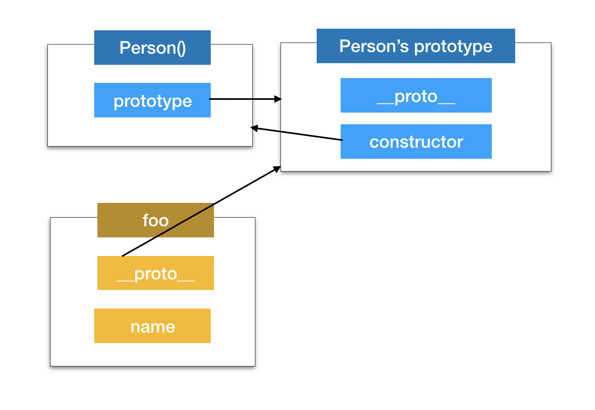
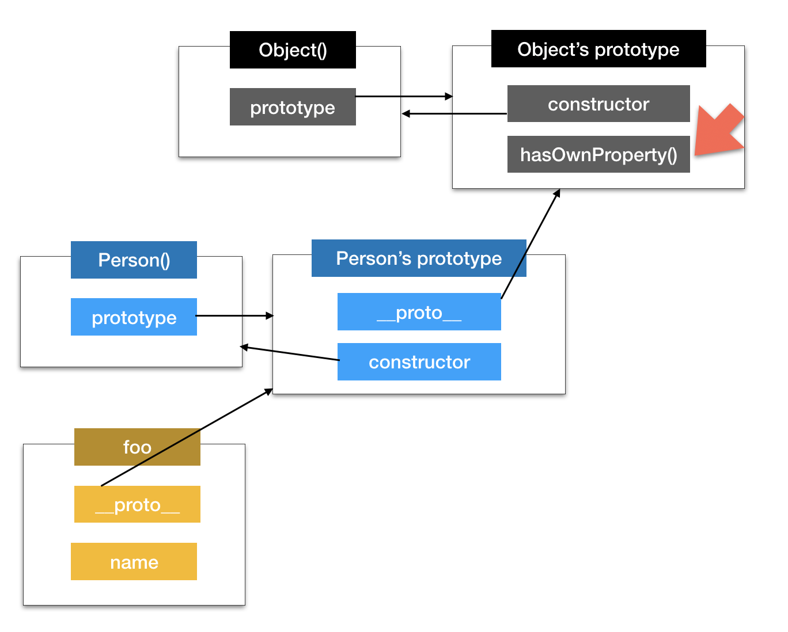
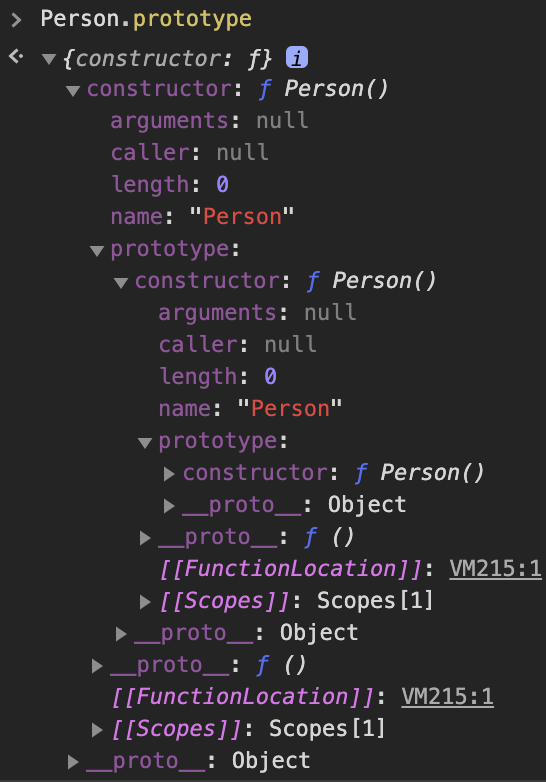
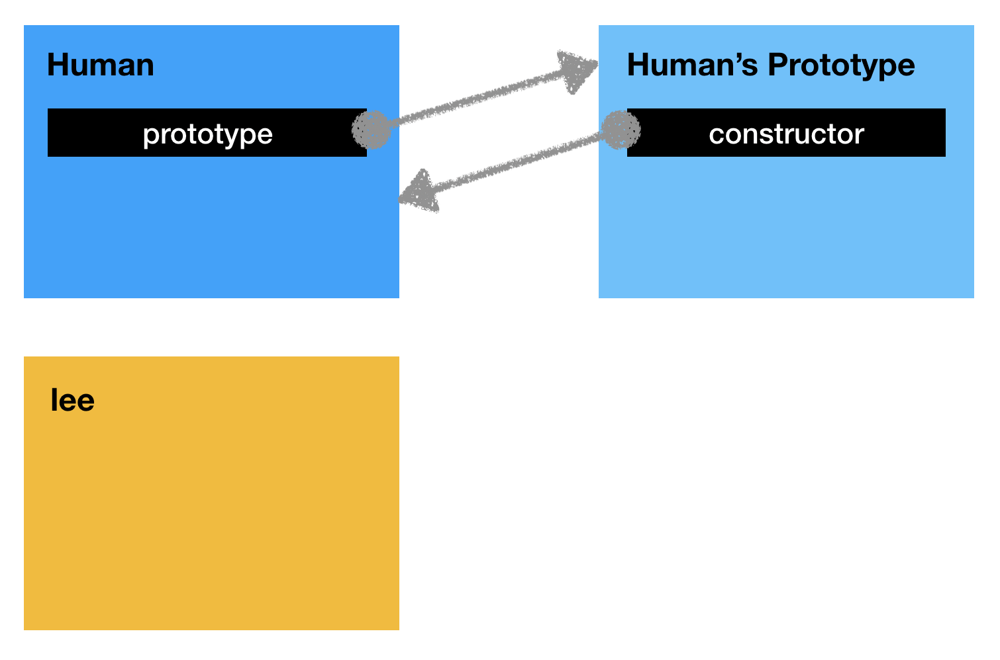
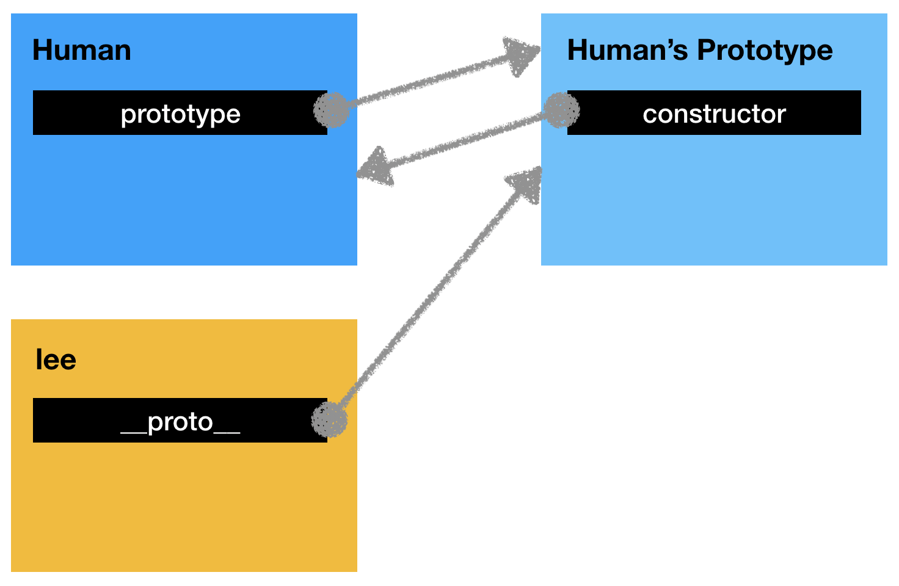
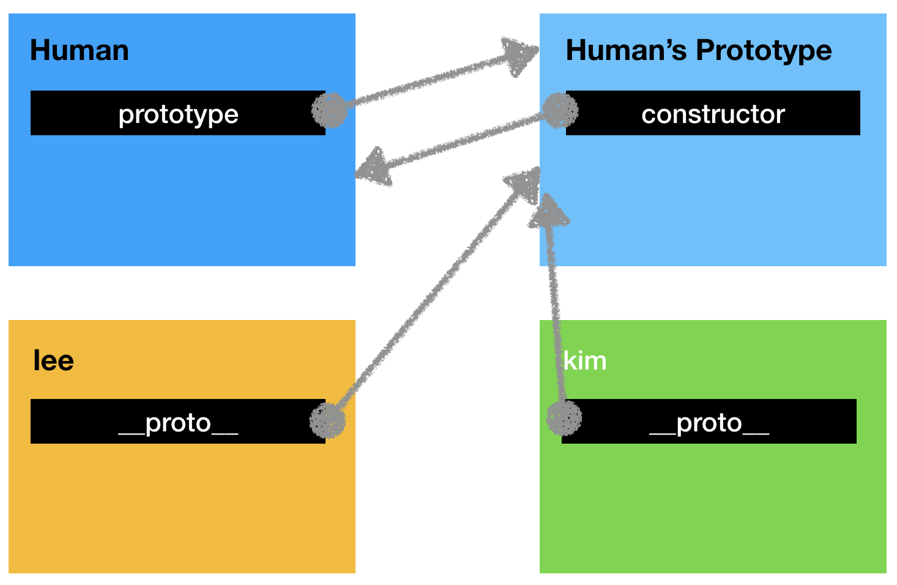
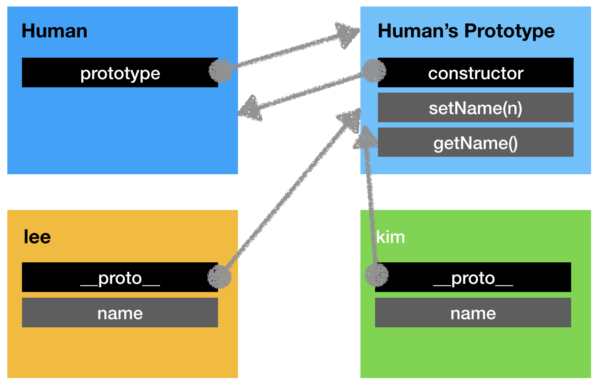

# 주제

## 발표자

- 이상아

## 참여자

- 김라희, 김주완, 안소현, 양유성


## 내용

### 들어가기 전에

> Prototype이라는 내용에 대해 구글링하면 `[[Prototype]]`, `__proto__`, `prototype` 의 세 키워드를 볼 수 있다. 언뜻보면 비슷해보이는 이 세 단어들은 다른 의미를 갖고 있다.

> 따라서 프로토타입 자체를 이야기하는 것 보다, **객체들이 어떻게 연결되어있는지** 와 **프로토타입 체이닝** 으로 프로토타입에 대해 이야기를 하는게 좋을 것 같다는 생각이 들어, 그렇게 내용을 작성하였다.

### Prototype?

* 우리말로 Prototype은 '원형' 을 말한다.
* 이걸 자바스크립트에 들여와서 생각을 해보자. 자바스크립트가 무엇이냐 검색하면 **자바스크립트는 프로토타입 기반 객체지향 언어입니다.** 라는 글을 볼 수 있다.
* 이 말은, **자바스크립트의 객체들은 어떤 원형을 갖고 있겠구나** 라는 생각을 하게끔 한다. 그리고 이에 대한 대답은 **맞다** 이다. (추가로 자바스크립트를 이루고 있는 거의 모든 것은 객체로 존재한다)

* 그렇다면, 자바스크립트에서 **객체를 만들 수 있는 '함수'** 를 예시로 들어보겠다.

```javascript
function Person() { ... }
```

* 이렇게 만들어진 `Person(){}` 의 원형, prototype 을 보자. 아래 내용은 `Person.prototype` 의 결과물이다.

```javascript
{constructor: ƒ}
  constructor: ƒ Person()
  __proto__: Object
```

* 지금 당장 `constructor` 와 `__proto__` 가 무엇인지는 모르지만, 이들이 나타내는 것을 보면 어떤 의미인지 직감적으로 유추 해볼 수 있다. 
  *  `constructor` 는 `Person()` 을 의미하고, `__proto__` 는 `Object` 를 의미하고 있다.
  * 이를 통해서, `constructor` 는 자기자신을 의미하는거같고.. `__proto__` 는 자신의 부모를 말하는 것 같은데? 하는 생각을 할 수 있다.
* 좀더 정확한 의미는 아래에서 설명한다.


### 객체들은 어떻게 연결되어있을까?

1. 자바스크립트에서 함수가 생성되면, 내부적으로 이런 일이 일어난다.

```javascript
function Human() { ... }
```





* `Human(){}` 함수 객체와 함수에 대한 `prototype` 객체가 생기게 된다. 이들이 서로 연결되어있다는 것은 **상호 참조**된 `prototype`, `constructor` 속성으로 알 수 있다.

  

  * 위 캡쳐에서 보면, `Person.prototype - constructor - prototype - constructor - prototype ...` 의 구조를 갖는 것을 볼 수 있다. 이러한 구조를 갖는 이유는, 위에서 말한 **상호 참조** 때문이다.
  * (`constructor` 는 객체의 입장에서 자신을 생성한 객체를 가리킨다)

  

2. prototype으로 `Human` 을 가리키는 객체 `lee` 를 만들어보자.

```javascript
const lee = new Human();
```





* `const lee = new Human()` 는 두 가지 과정으로 볼 수 있다.
  1. `const lee` 객체를 만든다.
  2. ***객체 `lee` 와 `Human` 을 이어준다.***
* `__proto__` 는 아래 **상속? 위임?** 에서 다룰 것이다.


3. prototype으로 `Human` 을 가리키는 객체 `kim` 을 만들어보자.

```javascript
const kim = new Human();
```




#### 상속? 위임?

* 앞서 본 그림에서 2, 3 번을 좀 더 자세히 보자. 

```javascript
const lee = new Human(); // 2
const kim = new Human(); // 3
```

* 이는 우리가 익숙한 클래스 기반의 객체 지향 언어(이를테면 `Java`)와 내부적으로 다른 모습을 갖는다.

* 우리가 익숙한, 기존 클래스 기반 객체 지향 언어 (`Java`) 에서는 이와 같은 경우를 이렇게 말했다.

  > 2번과 3번에서 각각 Human의 인스턴스인 lee, kim을 만들었다

* 하지만 자바스크립트는 이와 같은 경우를 이렇게 말한다.

  > 2번과 3번에서 각각 Human의 prototype에 접근할 수 있는 권한을 갖는 두 객체 lee, kim을 만들었다.

* 즉 만든 객체 `lee`, `kim` 에다가 `Human` 의 인스턴스를 만들어 그대로 넣어주는 것(복사)이 아니라, `Human` 의 `prototype`에 **접근할 수 있게끔(공유)** 하는 것이다. 그리고 그것을 가능하게 하는 것이 `__proto__` 이다. 

* 그래서 **상속** 이라는 표현 보다는, 권한의 **위임** 이라는 표현이 보다 적합하다고 할 수 있다.


### Prototype Chaining

* 바로 위에서 `__proto__` 를 통해서, `kim`, `lee` 는 `Human` 의 `prototype` 에 접근할 수 있다고 하였다.  그렇다면 **그걸로 무엇을 할 수 있을까?** 
* 예시를 들어보자.

```javascript
Human.prototype.setName = function(n) { this.name = n; }
Human.prototype.getName = function() { return this.name; }
```



* `Human`의 `prototype`에 두 함수를 추가하였다. 객체 `lee`, `kim` 이 `setName(n)`, `getName()` 을 사용하고 싶다면, 이렇게 사용하면 된다.

```javascript
kim.setName("kim");
lee.setName("lee");
```

* 여기서 의문이 생긴다. 

> `lee`, `kim` 안에 그 함수들이 있는것도 아닌데, 어떻게 실행한거지?

* 답은 `__proto__` 를 타고 `Human` 의 `prototype` 에서 두 함수를 찾았기 때문이다.

* 즉 원하는 것을 찾을 때 까지 `__proto__` 를 계속해서 타고 타고 가는 것을 **prototype chaining** 이라고 한다.


### Prototype Object, Prototype Link

- 지금까지 `prototype` 과 `__proto__` 를 봤다. 둘은 약간의 차이가 있다.

### `prototype`

* `prototype` 은 함수가 갖는 prototype 객체 자체를 말한다.
* 때문에 `prototype` 은 `prototype object` 라고 하기도 한다.

### `__proto__`

* `__proto__` 는 객체의 원형의 `prototype` 을 가리키는 링크를 말한다.
* 때문에 `__proto__` 는 `prototype link` 라고 하기도 한다.


### `[[Prototype]]`

* 그렇다면 글에서 다루지 않은 `[[Prototype]]` 이란 무엇일까? 내부 변수를 말한다.
* `__proto__` 를 통해서 `[[Prototype]]` 에 접근할 수 있다.
* `[[Prototype]]` 은 내부변수로, 우리가 코드에서 직접 접근할 수 없다. 


## Reference

* [opentutorials: `__proto__` vs `prototype`](https://www.opentutorials.org/module/4047/24629)
* [[PoiemaWeb] Prototype](https://poiemaweb.com/js-prototype)
* You Don't Know JS (this와 객체 프로토타입, 비동기와 성능)