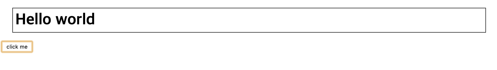
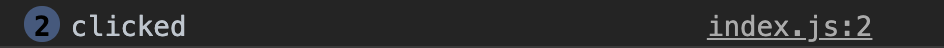

# 주제

## 발표자

- 김라희


## 참여자

- 안소현, 양유성, 이상아, 이소윤


## 내용

## HTML

`HyperText Markup Language` 의 약자로, 웹 문서를 만들 때 사용하는 웹 페이지 프로그래밍 언어 중의 하나다. 

이 언어를 이용해 웹 문서의 뼈대를 제작할 수 있다.

```html
<html>
  <head>
    <meta charset="utf-8" />
    <title>Hello world</title>
    <link rel="stylesheet" href="style.css" />
  </head>
  <body>
    <h1>
      Hello world
    </h1>
  </body>
  <button class="btn">click me</button>
  <script type="text/javascript" src="index.js"></script>
</html>
```


## CSS

`Cascading Style Sheets` 의 약자로, 웹 문서의 **스타일**을 설정할 때 사용하는 프로그래밍 언어이다.

HTML과 결합하여 HTML로 작성한 페이지에 디자인을 입일 수 있다.

```css
h1 {
  border: 1px solid black;
  padding: 5px;
  margin: 20px;
}
```


## Javascript

웹 페이지에서 동적인 일을 하기 위해 사용하는 언어이다. 색깔을 바꾼다거나, 버튼을 클릭했을 때 어떤 일을 발생하게 한다거나 등을 할 수 있다.

```javascript
const btn = (document.querySelector(".btn").onclick = function() {
  console.log("clicked");
});
```


## 화면 캡쳐



