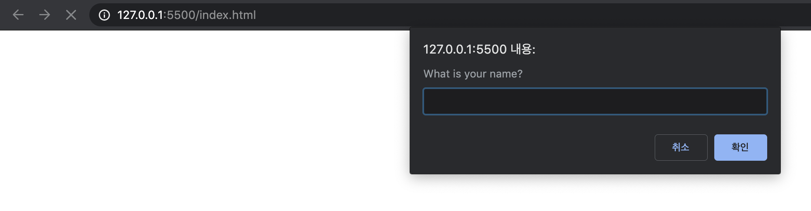
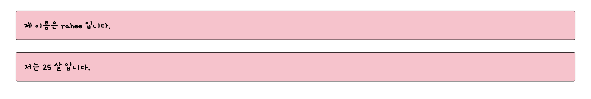

# 주제

## 발표자

- 김라희


## 참여자

- 안소현, 양유성, 이상아, 이소윤


## 내용

입력을 받아서 그 내용을 화면에 보여주는 예제를 만들어보았다.


## HTML

```html
<html>
  <head>
    <meta charset="utf-8" />
    <title>Hello world</title>
    <link
      href="https://fonts.googleapis.com/css?family=Gamja+Flower&display=swap"
      rel="stylesheet"
    />
    <link rel="stylesheet" href="style.css" />
  </head>
  <body>
    <div class="parent">
      <h2>제 이름은 <span class="name"></span> 입니다.</h2>
      <h2>저는 <span class="age"></span> 살 입니다.</h2>
    </div>
  </body>
  <script type="text/javascript" src="index.js"></script>
</html>

```


## CSS

```css
h2 {
  border: 1px solid black;
  padding: 20px;
  margin: 20px;
  background: pink;
  margin: 30px;
  font-family: "Gamja Flower", cursive;
  border-radius: 5px;
}
```


## Javascript

```javascript
const parent = document.querySelector(".parent");

const name = document.querySelector(".name");
const age = document.querySelector(".age");

(function init() {
  if (name.innerHTML.length < 1 || age.innerHTML.length < 1) {
    setState(0);

    promptInfo();
  }
})();

function promptInfo() {
  const getName = prompt("What is your name?");
  const getAge = prompt("How old are you?");

  setState(1);

  name.innerHTML = getName;
  age.innerHTML = getAge;
}

function setState(v) {
  switch (v) {
    case 0:
      parent.style.visibility = "hidden";
      parent.style.visibility = "hidden";
      return;

    case 1:
      parent.style.visibility = "visible";
      parent.style.visibility = "visible";
      return;
  }
}
```


## 화면 캡쳐





