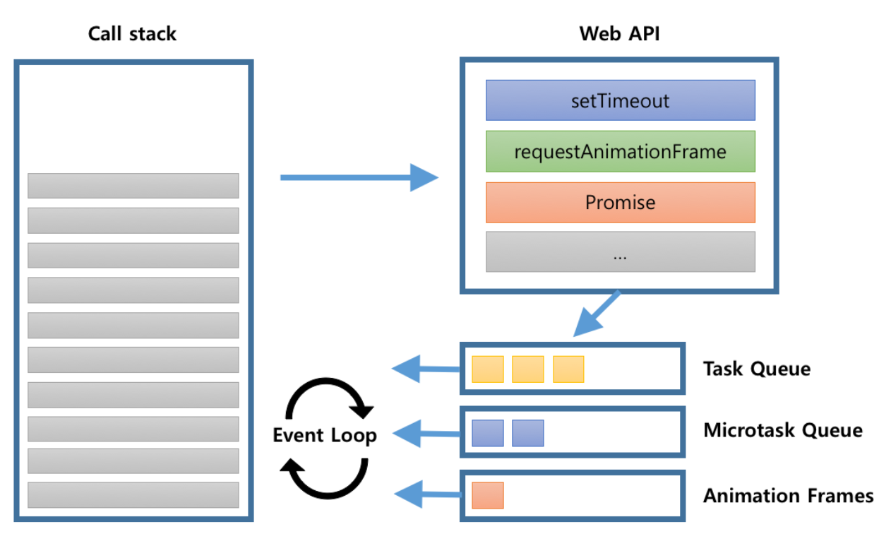

# 주제

## 발표자

- 양유성

## 참여자

- 김라희, 김주완, 안소현, 양유성, 이상아

## 내용

### 비동기 호출

#### 동기(synchronous)와 비동기(asynchronous)
일반적인 프로그램은 실행시 하나의 프로세스와 다수의 쓰레드를 가진다. 이때 동기적인 프로그램과 비동기적인 프로그램의 차이가 존재하는데, 그 차이에 대하여 우선 설명하고자한다.

두 객체 X와 Y가 있고, X와 Y는 각자 A와 B작업을 해야한다고 가정해보자. 이때, 서로가 서로의 작업인 A,B에 대하여 알고 있을 때, 그리고 서로의 작업이 언제 시작하고 끝나는지 알고 행동할 때, 두 객체는 동기화되어있다고 할 수 있다. 특히, B작업의 시작이 A작업의 끝 이후 바로 실행되어야한다는 등, 작업간의 flow가 연결되어있을 때, 두 작업 또한 동기화되어있다고 할 수 있다.

반면에, 두 객체 X와 Y가 각자의 일인 A와 B를, 서로간의 상황에 관계없이 스스로가 원할 때 실행한다면, 이 두 객체는 서로 상태나 상황을 공유하지 않는 것이고, 이는 즉 두 객체가 비동기화되어있다고 할 수 있다. 나아가, 각 작업이 서로의 flow에 영향을 받지 않고, 각자 알아서 실행된다면, 두 작업은 비동기화 되어있다고 할 수 있다.

정리하자면 여러 객체가 각자의 상태 및 상황을 공유하며 작업을 순차적으로 진행하는 것을 동기적인 작업이라하며, 반면에 각자의 작업을 알아서 원할때 바로바로 실행하는 것을 비동기적인 작업이라한다.

일반적인 상황에서 대부분의 코드는 동기적으로 일어난다. 하지만 쓰레드와 같은 별도의 기능을 사용하여 비동기적으로 함수를 호출하거나 코드를 실행할 수 있는데, 자바스크립트에서는 어떻게 비동기 호출을 진행하는지 알아보자.

#### 자바스크립트에서의 비동기 호출
자바스크립트는 기본적으로 싱글 쓰레드만을 지원하는 언어이다. 따라서 다중 쓰레드를 생성하여 비동기적 작업을 실행할 수 없다. 때문에 자바스크립트는 Call Stack, Web API, Task Queue, Event Loop라는 요소들을 채택하여 비동기 호출을 지원한다.  

*(이후 내용은 http://sculove.github.io/blog/2018/01/18/javascriptflow/ 을 참고함.)*



위는 Call Stack, Web API, Task Queue 그리고 Event Loop를 시각화한 이미지이다.

자바스크립트는 Call Stack에 있는 작업을 우선적으로 처리한다. 동시에 Event Loop가 Web API를 통하여 Queue에 등록된 작업을 Call Stack에 쌓는다. 기본적으로 코드 상에서 실행되는 함수를 Call Stack에 쌓아가며 처리하고, IO 작업과 같은 외부적인 작업을 Web API와 Task Queue가 처리하는 것이다.

이와 관련하여 코드를 직접 실행해보며 시각화된 요소들을 볼 수 있는 [웹사이트](http://latentflip.com/loupe/?code=JC5vbignYnV0dG9uJywgJ2NsaWNrJywgZnVuY3Rpb24gb25DbGljaygpIHsKICAgIHNldFRpbWVvdXQoZnVuY3Rpb24gdGltZXIoKSB7CiAgICAgICAgY29uc29sZS5sb2coJ1lvdSBjbGlja2VkIHRoZSBidXR0b24hJyk7ICAgIAogICAgfSwgMjAwMCk7Cn0pOwoKY29uc29sZS5sb2coIkhpISIpOwoKc2V0VGltZW91dChmdW5jdGlvbiB0aW1lb3V0KCkgewogICAgY29uc29sZS5sb2coIkNsaWNrIHRoZSBidXR0b24hIik7Cn0sIDUwMDApOwoKY29uc29sZS5sb2coIldlbGNvbWUgdG8gbG91cGUuIik7!!!PGJ1dHRvbj5DbGljayBtZSE8L2J1dHRvbj4%3D)를 소개한다.

### 타이머 API
자바스크립트에서의 타이머(Timer)는 특정 기능을 바로 실행하지않고, 일정 시간 이후에 실행되도록 지연을 줄 때 사용하는 요소이다. 자바스크립트는 `setTimeout()`과 `setInterval()`을 통하여 타이머 기능을 제공하고 있다.

`setTimeout(함수명, 시간(ms))`은 일정 시간 이후 특정 작업을 한 번만 실행하고 싶을 때 사용하는 함수다. 특히 두번째 인자인 시간은 밀리초 기준이며, 1000밀리초를 1초로 가정한다.

`setInterval(함수명, 시간(ms))`은 일정 시간마다 특정 함수를 지속적으로 실행하기 위해 사용하는 함수다. 이 코드는 특별한 조건이 없으면 지속적으로 함수를 실행하는데, 이를 멈추는 함수가 `clearInterval()`이다.

`setInterval()`을 사용할 때, 아래와 같이 반환값을 저장해두면 해당 변수값을 통하여 차후 타이머 객체를 초기화 시켜 타이머를 중지할 수 있다. 이때, `setInterval()`의 반환값은 설정된 타이머 객체의 ID 값이다.

``` javascript
timerID = setInterval("testFunction1()", 3000);
document.getElementById('btn_stopTimer').onclick = function() {
	clearInterval(timerID);
}
```
위 코드는 `btn_stopTimer1`라는 ID를 가진 버튼을 클릭하였을 때, `testFunction1()`을 주기적으로 실행하는 타이머 객체를 초기화하여 중단시키는 코드다.